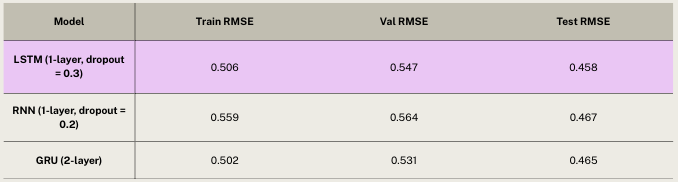

# Energy Consumption Prediction Analysis
Stat 362 - Fall 2025
Team Members: Celena Kim, Sarah Kim, Benjamin Pilnick, Emily Yoo

# Problem Description and Dataset 
Residential electricity use comprises a significant portion of overall energy demand, and utilities must match that demand with supply in real time. When energy usage is unpredicated, it can drive up operating costs, increase reliance on carbon-heavy plants, and put extra strain on the grid. On the household side, having better forecasts of electricity use can help people make smarter choices such as adjusting thermostats, timing when they run appliances, or coordinating things like home batteries and EV charging. Therefore, our goal for this project is to **predict hourly household electricity usage (Global_active_power)** using past consumption patterns and related electrical measurements.

The dataset we utilized for this analysis is the "Individual household electric power consumption Data Set" from the UCI Machine Learning Repository. [Link text](https://archive.ics.uci.edu/dataset/235/individual+household+electric+power+consumption). The data was collected from a single household over a period of almost 4 years, from December 2006 to November 2010. The dataset contains measurements of electric power consumption in one-minute intervals. We are using Global_active_power as our target variable. 

# High-level description of models
This project includes both baseline models and deep learning architectures. Before training any models, we performed the following preprocessing steps:
- Forward-filled missing values  
- Converted minute-level data → hourly averages
- Parsed timestamps and extracted time features
- Added cyclical time encodings (sin/cos for hour, day, month, weekend)
- Normalized features + target using StandardScaler
- Split dataset into train/validation/test (70%/15%/15%)
- Created sliding window sequences: 24-hour lookback → 1-hour-ahead forecast
- Constructed 3D model inputs

Our baseline model was a single-layer LSTM using the previous 24 hours of data to predict the next hour. Using a rolling sliding-window evaluation, the baseline achieved:
- Train RMSE: 0.608
- Validation RMSE: 0.516
- Test RMSE: 0.551

We then expanded to compare three deep learning architectures under the same preprocessing pipeline. All models use a 24-hour sliding window to predict the next hour of electricity usage and share the same training configuration (Adam optimizer, learning rate 0.001, batch size 32, and early stopping):
1. LSTM 
   - Architecture: 1 hidden layer (100 units)
   - Regularization: Dropout 0.3
   - Training: 20 epochs with early stopping
   - Rationale: The dataset’s temporal patterns were not complex enough to require deeper LSTM stacks, so a single-layer LSTM provided sufficient capacity while avoiding overfitting.
2. RNN 
   - Architecture: 2 hidden layers (64 → 32 units) + output layer
   - Regularization: Dropout 0.2
   - Training: 27 epochs with early stopping
   - Rationale: A smaller dropout rate stabilized training while still allowing the model to learn meaningful temporal structure within the sequence data.
3. GRU
   - Architecture: 2 hidden layers (64 → 32 units) + output layer
   - Regularization: None
   - Training: 40 epochs with early stopping
   - Rationale: Stacking GRU layers enabled the model to capture temporal patterns across multiple time scales.

# Summary of key results
Across all models, we evaluated forecasting performance using RMSE and achieved the following results:

Out of the 3 models, the LSTM with a single 100-unit later and 0.3 dropout achieved the lowest test RMSE of 0.458, slightly outperforming both the RNN and GRU architectures.

Based on this graph of true vs. predicted energy consumption for the first 400 hourly test samples, we see that model is able to accurately catch the overall pattern and timing of peaks, with some extreme spikes being underestimated. 

Additionally, the training and validation loss curves for the LSTM model both decrease steadily as the epochs increase, suggesting stable learning and generalization to unseen data.

# How to run the code
Basic commands to run one or two representative experiments or demos

